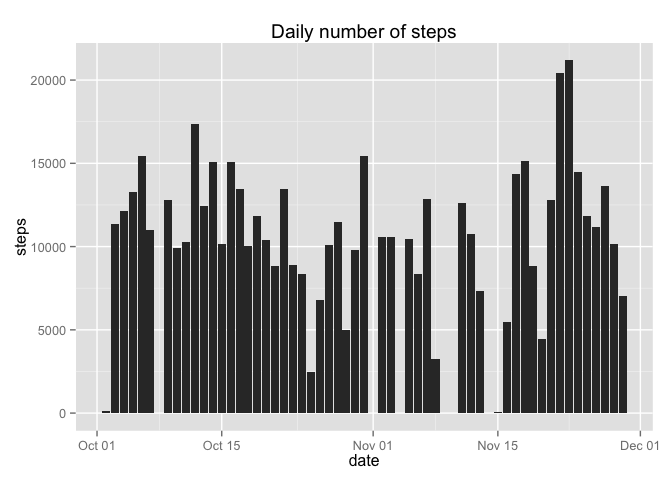
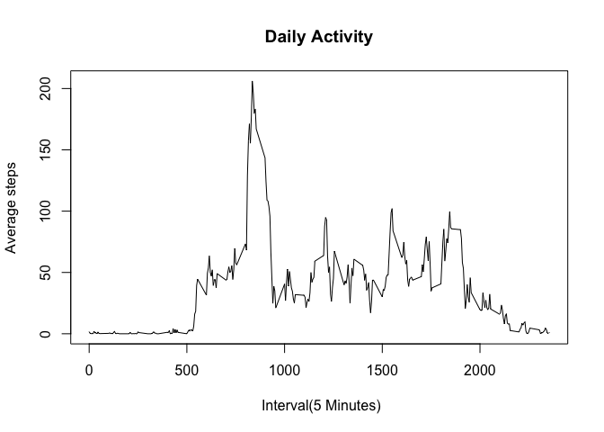
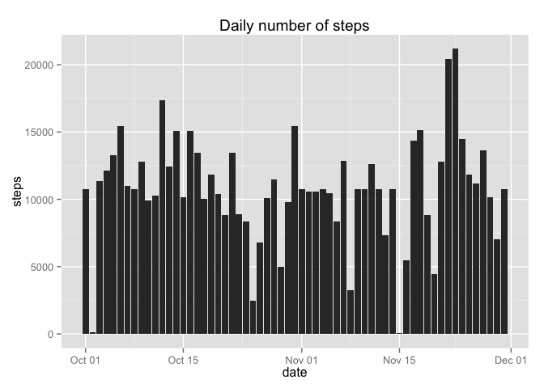
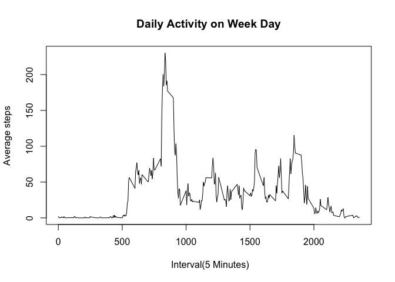
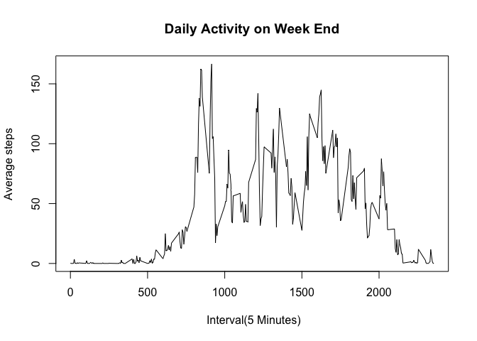

# Reproducible Research: Peer Assessment 1


## Loading and preprocessing the data

We uncompressed the data in the working directory and load the dataset from the csv file.


```r
Sys.setlocale("LC_TIME", "en_US")
```

```
## [1] "en_US"
```

```r
file.name <- unzip('activity.zip')
df.activity <- read.csv(file.name, stringsAsFactors = FALSE)
```

We converted the date string to suitable date format. We removed entries with missing data.


```r
df.activity$date <- as.Date(df.activity$date)

df.activity.clean <- df.activity[which(!is.na(df.activity$steps)),]
```

## What is mean total number of steps taken per day?

We aggregated the number of steps per day of the dataset cleaned from missing value


```r
df.activity.daily = aggregate(steps~date, data=df.activity.clean,FUN=sum)
```

We plotted an histogram of the number of steps per day.


```r
library(ggplot2)

hist <- ggplot(df.activity.daily, aes(x=date, y=steps)) +
                geom_bar(stat='identity')+ 
        ggtitle("Daily number of steps")
hist
```

 

The average number of steps per day is 1.0766189\times 10^{4} for a median of 10765.


```r
mean(df.activity.daily$steps)
```

```
## [1] 10766.19
```


```r
median(df.activity.daily$steps)
```

```
## [1] 10765
```


## What is the average daily activity pattern?

We are trying to understand the daily pattern. 

In order to do so, we first aggregated the steps per interval accross the day.

```r
df.pattern <- aggregate(steps~interval, data=df.activity.clean,FUN=mean)
```

We plotted the average number of steps for each 5 minutes day interval accross the day.


```r
plot(x = df.pattern$interval, y = df.pattern$steps, 
     type = "l", xlab = " Interval(5 Minutes)", 
     main = "Daily Activity", ylab = "Average steps")
```

 

We found what is the daily interval with maximum number of average steps.


```r
df.pattern[df.pattern$steps == max(df.pattern$steps),]
```

```
##     interval    steps
## 104      835 206.1698
```

## Imputing missing values

We wanted to study the impact of missing values in the dataset.

We first computed the number of entries(rows) with missing steps value in the dataset.


```r
sum(is.na(df.activity) )
```

```
## [1] 2304
```

We filled the missing values using our daily activities data. We used the interval average for each entry with missing steps.


```r
df.merge = merge(df.activity, df.pattern, by='interval', all.x=TRUE)
df.fill = df.merge
df.fill[which(is.na(df.fill$steps.x)),'steps.x']<- 
        df.fill[which(is.na(df.fill$steps.x)),'steps.y']
library(plyr)
df.fill <- rename(df.fill, c("steps.x"="steps"))
df.fill <- df.fill[c('interval','steps','date')]
```


We then reproduced the previous histogram on the modified dataset.

We first performed a new daily aggregation.


```r
df.activity.daily.fill = aggregate(steps~date, data=df.fill,FUN=sum)
```

We finally plotted an histogram of the number of steps per day.


```r
library(ggplot2)

hist <- ggplot(df.activity.daily.fill, aes(x=date, y=steps)) +
                geom_bar(stat='identity') +
                ggtitle("Daily number of steps")
hist
```

 

The average number of steps per day is now  1.0766189\times 10^{4} for a median of 1.0766189\times 10^{4}.


```r
mean(df.activity.daily.fill$steps)
```

```
## [1] 10766.19
```


```r
median(df.activity.daily.fill$steps)
```

```
## [1] 10766.19
```

The mean is identical but the median is now equal to mean when it was slightly lower before. This is most likely due to the fact that we kind of inserted "average day" in the dataset with our filling strategy, biasing the median.

## Are there differences in activity patterns between weekdays and weekends?


We created a new variable in the data set to identify the type of day(weekdays,weekends).


```r
df.fill$day.type <-  
        as.factor(ifelse(weekdays(df.fill$date) %in% c('Saturday','Sunday'),
                'weekend','weekday'))
```


We created two subsets, one for each day type.


```r
df.fill.weekday <- subset(df.fill, day.type == "weekday") 
df.fill.weekend <- subset(df.fill, day.type == "weekend") 
```

We then plotted the daily activity for week day:


```r
df.pattern.weekday <- aggregate(steps~interval, data=df.fill.weekday,FUN=mean)
plot(x = df.pattern.weekday$interval, y = df.pattern.weekday$steps, 
     type = "l", xlab = " Interval(5 Minutes)", 
     main = "Daily Activity on Week Day", ylab = "Average steps")
```

 

And the daily activity for week end:


```r
df.pattern.weekend <- aggregate(steps~interval, data=df.fill.weekend,FUN=mean)

plot(x = df.pattern.weekend$interval, y = df.pattern.weekend$steps, type = "l", xlab = " Interval(5 Minutes)", 
    main = "Daily Activity on Week End", ylab = "Average steps")
```

 

We concluded that week days and week-end have fairly different daily activity patterns.
